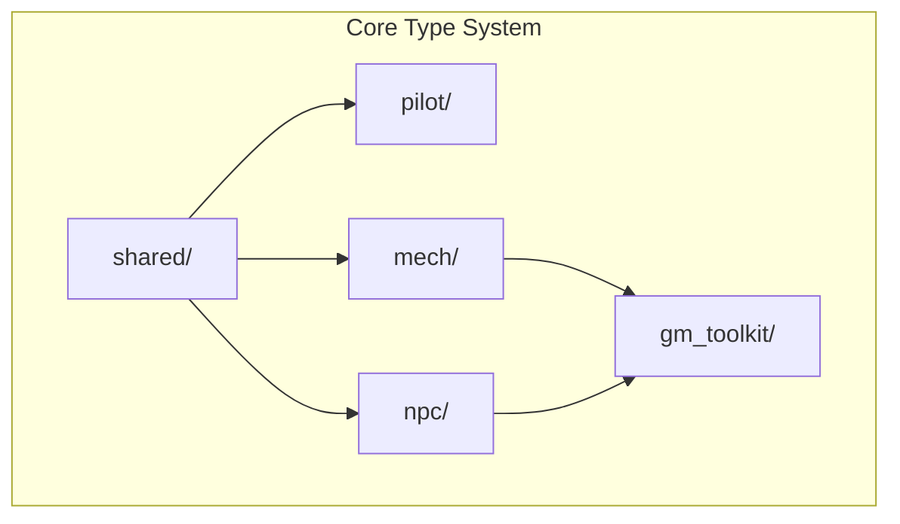

# Agents Documentation

## Project Context
This project is a **monorepo** for Lancer TTRPG tooling with three domains:
1. **`/core`**: Type-driven game schemas using Pydantic v2
2. **`/llm`**: Synthetic data generation and LLM fine-tuning pipeline
3. **`/app`**: Future application layer (placeholder)

## Monorepo Structure

```
trpg-llm-playground/
├── core/                   # Type-driven Lancer schemas
│   ├── pilot/              # Pilot domain (skills, talents, licenses)
│   ├── mech/               # Mech domain (frames, weapons, combat)
│   ├── shared/             # Shared types and combat systems
│   │   ├── effects/        # Effect type system
│   │   ├── combat/         # Combat tracking
│   │   └── campaign/       # Campaign persistence
│   ├── npc/                # NPC system (53 templates)
│   ├── gm_toolkit/         # GM tools (SITREPs, encounters)
│   └── export.py           # JSON Schema export
├── llm/                    # LLM pipeline
│   ├── src/                # Data, RAG, training modules
│   ├── colab/              # Notebooks (run from llm/)
│   ├── scripts/            # CLI tools
│   ├── config/             # YAML configs
│   └── tests/              # LLM pipeline tests
├── app/                    # Future web application
├── books/                  # Source PDFs (shared)
├── models/                 # GGUF models (shared)
└── notes/                  # Planning documents
```

## Core Type System (`/core`)

### Architecture



### Pilot Domain (`core/pilot/`)
- **`skill.py`**: 4 mech skills (HULL, AGI, SYS, ENG) with triggers
- **`background.py`**: 20 pilot backgrounds with starting triggers
- **`talent.py`**: 34 talents with 3-rank definitions
- **`license.py`**: Manufacturer licenses (IPS-N, SSC, HORUS, HA)
- **`core_bonus.py`**: 31 core bonuses earned from maxed licenses
- **`pilot.py`**: Main Pilot model composing all above

### Mech Domain (`core/mech/`)
- **`frame.py`**: 29 frame definitions (size, armor, HP, mounts)
- **`weapon.py`**: 88 weapons with profiles, tags, damage specs
- **`system.py`**: 124 systems (tech, deployables, drones)
- **`combat_state.py`**: Mech combat state tracking
- **`combat_resolution.py`**: Structure/overheat/meltdown resolution
- **`compendium.py`**: GMS, IPS-N, SSC, HORUS, HA gear lookups

### Shared Types (`core/shared/`)
- **`ids.py`**: Typed ID definitions (NewType) for compile-time safety
- **`enums.py`**: ActionType, DamageType, RangeType, StatusType, etc.
- **`dice.py`**: DiceExpression with parsing, rolling, and stats
- **`effects/`**: Mechanical effect primitives (136 effect types)
  - `types.py`: Literal type aliases
  - Effect classes: damage, status, movement, tech, etc.
- **`combat/tactical_initiative.py`**: Nomination-based turn order (PR2 3703-3725)
- **`campaign/`**: Campaign persistence and serialization

### NPC Domain (`core/npc/`)
- **`template.py`**: 53 NPC templates with tier/class definitions
- **`compendium.py`**: NPC template lookups
- **`combat.py`**: NPC combat behavior

### GM Toolkit (`core/gm_toolkit/`)
- **`sitrep.py`**: 6 SITREP templates (Escort, Control, Extract, etc.)
- **`encounter.py`**: Encounter generation and balancing
- **`world.py`**: World/setting generation helpers

### JSON Schema Export
```bash
python -m core.export --output-dir schemas/
python -m core.export --combined  # Single combined schema
```

## LLM Pipeline (`/llm`)

### Configuration
- **`llm/config/rpg_finetune.yaml`**: Training hyperparameters
- **`llm/config/synthetic_generic.yaml`**: Synthetic data settings
- **`llm/config/templates/*.yaml`**: Pre-built RPG configs

### Synthetic Data Pipeline
- **`llm/src/data/generate_synthetic.py`**: Main orchestrator
- **`llm/src/data/synth_prompts.py`**: Prompt templates
- **`llm/src/data/synth_multiturn.py`**: Multi-turn conversations
- **`llm/src/data/synth_walkthrough.py`**: Step-by-step walkthroughs
- **`llm/src/data/synth_filter.py`**: Topic-based chunk filtering
- **`llm/src/data/synth_difficulty.py`**: Difficulty stratification
- **`llm/src/data/synth_negatives.py`**: "Not found" examples
- **`llm/src/data/synth_verify.py`**: Answer verification
- **`llm/src/data/synth_dedup.py`**: Semantic deduplication
- **`llm/src/data/synth_report.py`**: Quality dashboard

### Training & Evaluation
- **`llm/src/training/finetune_lora.py`**: Unsloth/LoRA training
- **`llm/src/training/evaluate_rpg.py`**: RPG-specific benchmarks
- **`llm/scripts/run_eval_benchmark.py`**: CLI for benchmarks
- **`llm/dataset/`**: Generated datasets (user-created eval sets go here)

### Local Inference
- **`llm/scripts/local_chat.py`**: Ollama + RAG chat (CLI/Gradio)
- **`llm/docs/LOCAL_CHAT.md`**: Setup guide

### Notebooks
- **`llm/colab/run_pipeline.ipynb`**: Full pipeline
- **`llm/colab/run_synthetic_only.ipynb`**: Synthetic only
- **`llm/colab/run_train_after_synth.ipynb`**: Training only

**Note**: Notebooks `cd` into `/llm` after cloning. All paths are relative to `llm/`.

## Conventions

### Core Domain
- **Pydantic v2**: Use `FrozenModel` base class for immutable game rules
- **Literal types**: Prefer `Literal["a", "b"]` over `Enum` for better IDE support
- **Typed IDs**: Use `NewType` IDs from `core/shared/ids.py` (e.g., `WeaponId`, `MechId`)
- **Effect primitives**: Build mechanical behaviors with types from `core/shared/effects/`

### LLM Pipeline
- **Paths**: Relative to `llm/` directory
- **Config-Driven**: All settings in YAML, no hardcoded values
- **Logging**: Clear status updates for Colab monitoring

### Testing
- **Core changes**: Run `make test-core` before committing.
- **LLM changes**: Run `make test-llm` (no third-party calls; mock mode is supported).

## Completed Features

### Core (3144 tests passing)
- ✅ **Pilot System**: Skills, backgrounds, 34 talents, licenses, 31 core bonuses, cloning
- ✅ **Mech System**: 29 frames, 88 weapons, 124 systems, combat state tracking
- ✅ **Combat System**: Actions, conditions, initiative, heat/structure/stress
- ✅ **NPC System**: 53 templates, AI behaviors, tier/class system
- ✅ **GM Toolkit**: SITREPs, encounters, world generation
- ✅ **Effects System**: 136 mechanical effect types with typed primitives
- ✅ **Typed IDs**: NewType definitions for compile-time ID safety
- ✅ **JSON Schema Export**: Individual and combined schema files

### LLM
- ✅ **RAG Integration**: Heading-aware chunking, FAISS indexing
- ✅ **Multi-Turn Generation**: Follow-up conversations
- ✅ **Quality Pipeline**: Verification, deduplication, negatives
- ✅ **Multi-RPG Templates**: D&D, Lancer, Blades configs
- ✅ **Evaluation Benchmark**: Accuracy/grounding/citation metrics
- ✅ **Local Chat**: Ollama + RAG with Gradio UI

## Roadmap

### Current: Code Cleanliness (Phase 2)
- ✅ Phase 2A: HexCoord migration with coercion validators
- ✅ Phase 2B: Import consistency, `__all__` exports
- 🔲 Phase 2C: Split large modules (effects.py, combat_resolution.py)
- 🔲 Phase 2D: Generic type stubs, error message standardization

### Future
- Database layer (SQLModel integration)
- Web application (FastAPI + frontend)
- Game engine with type dispatch
- Character builder UI
