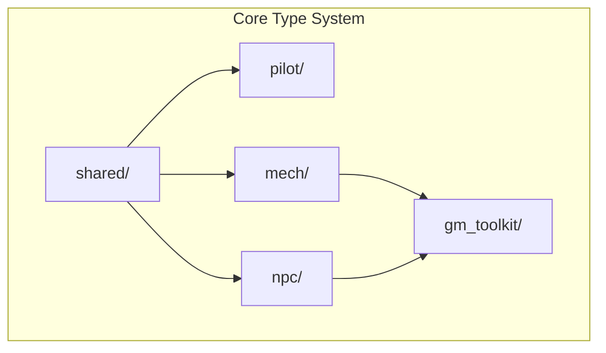

# Agents Documentation

## Core-First Philosophy (READ THIS FIRST)

This project is built on a **type-driven, core-first architecture**. The `/core` module is the foundation - a complete, validated mechanical system for the Lancer TTRPG with 3277+ tests. Everything else builds on top.

### The Golden Rule

> **Core is the source of truth. Never duplicate what core provides.**

When implementing any feature:

1. **Start with core** - Does the type/validation already exist? Use it.
2. **Fix gaps in core first** - Missing validation? Add it to core, not the API layer.
3. **API is a thin wrapper** - Passes data to core via `model_validate()`, converts errors.
4. **Frontend consumes types** - Generated from core via `make generate-types`.

### What Core Provides

```
core/
├── Character          # Unified pilot + mech (source of truth for a "character")
├── Pilot              # Skills, triggers, talents, licenses, core bonuses
├── Mech               # Frames, weapons, systems, combat state
├── validation.py      # Game rule enforcement (LL0 restrictions, point limits)
└── computed fields    # Grit, HP, derived stats - calculated at model level
```

### Anti-Patterns to Avoid

```python
# ❌ WRONG: Duplicating validation in API layer
class SkillSetInput(BaseModel):
    hull: int = Field(ge=0, le=6)  # Core already does this!

# ❌ WRONG: Custom types in frontend
interface Pilot { ... }  # Use generated types!

# ❌ WRONG: Recomputing derived values
mech_hp = frame_hp + hull * 2 + grit  # Core's computed_field does this!
```

### Correct Patterns

```python
# ✅ RIGHT: Let core validate
from app.backend.utils import validate_core_model
skills = validate_core_model(SkillSet, request.skills, "skills")

# ✅ RIGHT: Use core's computed fields
character = Character.model_validate(db_record.data)
hp = character.active_mech_stats.hp  # Computed from pilot + frame + bonuses

# ✅ RIGHT: Fix validation gaps in core
# If validation is missing, add it to core/pilot/validation.py, not the API
```

### Development Flow

```
1. Need new feature? → Check if core model exists
2. Core model missing? → Add to core/ with tests first
3. Validation missing? → Add to core validation, not API
4. API endpoint → Thin wrapper using validate_core_model()
5. Frontend → Use generated types from make generate-types
```

---

## Project Context

This project is a **monorepo** for Lancer TTRPG tooling with three domains:
1. **`/core`**: Type-driven game schemas using Pydantic v2 (3277+ tests)
2. **`/llm`**: Synthetic data generation and LLM fine-tuning pipeline
3. **`/app`**: Full-stack web application (FastAPI + TanStack Start)

## Monorepo Structure

```
trpg-llm-playground/
├── core/                   # Type-driven Lancer schemas
│   ├── pilot/              # Pilot domain (skills, talents, licenses)
│   ├── mech/               # Mech domain (frames, weapons, combat)
│   ├── shared/             # Shared types and combat systems
│   │   ├── effects/        # Effect type system
│   │   ├── combat/         # Combat tracking
│   │   └── campaign/       # Campaign persistence
│   ├── npc/                # NPC system (53 templates)
│   ├── gm_toolkit/         # GM tools (SITREPs, encounters)
│   └── export.py           # JSON Schema export
├── llm/                    # LLM pipeline
│   ├── src/                # Data, RAG, training modules
│   ├── colab/              # Notebooks (run from llm/)
│   ├── scripts/            # CLI tools
│   ├── config/             # YAML configs
│   └── tests/              # LLM pipeline tests
├── app/                    # Web application
│   ├── backend/            # FastAPI REST API
│   │   ├── api/            # Route handlers
│   │   ├── db/             # SQLModel + Alembic migrations
│   │   └── tests/          # pytest test suite
│   └── frontend/           # TanStack Start + React
│       ├── src/routes/     # File-based routing
│       ├── src/lib/        # API client, hooks, types
│       └── schemas/        # Generated JSON Schema
├── books/                  # Source PDFs (shared)
├── models/                 # GGUF models (shared)
└── notes/                  # Planning documents
```

## Core Type System (`/core`)

### Architecture



### Pilot Domain (`core/pilot/`)
- **`skill.py`**: 4 mech skills (HULL, AGI, SYS, ENG) with triggers
- **`background.py`**: 20 pilot backgrounds with starting triggers
- **`talent.py`**: 34 talents with 3-rank definitions
- **`license.py`**: Manufacturer licenses (IPS-N, SSC, HORUS, HA)
- **`core_bonus.py`**: 31 core bonuses earned from maxed licenses
- **`pilot.py`**: Main Pilot model composing all above

### Mech Domain (`core/mech/`)
- **`frame.py`**: 29 frame definitions (size, armor, HP, mounts)
- **`weapon.py`**: 88 weapons with profiles, tags, damage specs
- **`system.py`**: 124 systems (tech, deployables, drones)
- **`combat_state.py`**: Mech combat state tracking
- **`combat_resolution.py`**: Structure/overheat/meltdown resolution
- **`compendium.py`**: GMS, IPS-N, SSC, HORUS, HA gear lookups

### Shared Types (`core/shared/`)
- **`ids.py`**: Typed ID definitions (NewType) for compile-time safety
- **`enums.py`**: ActionType, DamageType, RangeType, StatusType, etc.
- **`dice.py`**: DiceExpression with parsing, rolling, and stats
- **`effects/`**: Mechanical effect primitives (136 effect types)
  - `types.py`: Literal type aliases
  - Effect classes: damage, status, movement, tech, etc.
- **`combat/tactical_initiative.py`**: Nomination-based turn order (PR2 3703-3725)
- **`campaign/`**: Campaign persistence and serialization

### NPC Domain (`core/npc/`)
- **`template.py`**: 53 NPC templates with tier/class definitions
- **`compendium.py`**: NPC template lookups
- **`combat.py`**: NPC combat behavior

### GM Toolkit (`core/gm_toolkit/`)
- **`sitrep.py`**: 6 SITREP templates (Escort, Control, Extract, etc.)
- **`encounter.py`**: Encounter generation and balancing
- **`world.py`**: World/setting generation helpers

### JSON Schema Export
```bash
python -m core.export --output-dir schemas/
python -m core.export --combined  # Single combined schema
```

## LLM Pipeline (`/llm`)

### Configuration
- **`llm/config/rpg_finetune.yaml`**: Training hyperparameters
- **`llm/config/synthetic_generic.yaml`**: Synthetic data settings
- **`llm/config/templates/*.yaml`**: Pre-built RPG configs

### Synthetic Data Pipeline
- **`llm/src/data/generate_synthetic.py`**: Main orchestrator
- **`llm/src/data/synth_prompts.py`**: Prompt templates
- **`llm/src/data/synth_multiturn.py`**: Multi-turn conversations
- **`llm/src/data/synth_walkthrough.py`**: Step-by-step walkthroughs
- **`llm/src/data/synth_filter.py`**: Topic-based chunk filtering
- **`llm/src/data/synth_difficulty.py`**: Difficulty stratification
- **`llm/src/data/synth_negatives.py`**: "Not found" examples
- **`llm/src/data/synth_verify.py`**: Answer verification
- **`llm/src/data/synth_dedup.py`**: Semantic deduplication
- **`llm/src/data/synth_report.py`**: Quality dashboard

### Training & Evaluation
- **`llm/src/training/finetune_lora.py`**: Unsloth/LoRA training
- **`llm/src/training/evaluate_rpg.py`**: RPG-specific benchmarks
- **`llm/scripts/run_eval_benchmark.py`**: CLI for benchmarks
- **`llm/dataset/`**: Generated datasets (user-created eval sets go here)

### Local Inference
- **`llm/scripts/local_chat.py`**: Ollama + RAG chat (CLI/Gradio)
- **`llm/docs/LOCAL_CHAT.md`**: Setup guide

### Notebooks
- **`llm/colab/run_pipeline.ipynb`**: Full pipeline
- **`llm/colab/run_synthetic_only.ipynb`**: Synthetic only
- **`llm/colab/run_train_after_synth.ipynb`**: Training only

**Note**: Notebooks `cd` into `/llm` after cloning. All paths are relative to `llm/`.

## Web Application (`/app`)

### Quick Start
```bash
make install-app    # Install Python + Node dependencies
cp .env.example .env
make db-up          # Start PostgreSQL (Docker)
make db-migrate     # Run migrations
make dev            # Start backend + frontend
```

### Backend Architecture (`app/backend/`)

FastAPI application with dependency injection pattern. **Remember: API is a thin wrapper around core.**

```python
# Adding a new endpoint
from fastapi import APIRouter, Depends
from app.backend.db.engine import get_session
from app.backend.dependencies import get_current_user
from app.backend.utils import validate_core_model  # Use shared utilities!
from core.pilot import Pilot  # Import core models directly

router = APIRouter(prefix="/resource", tags=["resource"])

@router.post("")
async def create_resource(
    body: dict,  # Accept raw dict, let core validate
    session: AsyncSession = Depends(get_session),
    user: dict = Depends(get_current_user),
):
    # Let core handle validation
    pilot = validate_core_model(Pilot, body, "pilot")
    # Store as JSON blob
    db_record.data = pilot.model_dump(mode="json")
```

**Key files:**
- **`main.py`**: FastAPI app factory with lifespan management
- **`config.py`**: pydantic-settings configuration from `.env`
- **`dependencies.py`**: Dependency injection (stub auth, easy to swap)
- **`exceptions.py`**: Custom exceptions → consistent JSON error format
- **`utils.py`**: Shared utilities for core model validation (use this!)
- **`serializers/`**: Core model → API response shaping helpers
- **`api/router.py`**: Main router aggregating all endpoints
- **`db/engine.py`**: Async SQLAlchemy engine + session dependency
- **`db/models.py`**: SQLModel tables (JSON blob pattern)

**Shared Utilities** (`app/backend/utils.py`):
```python
from app.backend.utils import (
    validate_core_model,
    validate_core_model_list,
    core_validation_error_to_api,
)

# Validate request data against core model
skills = validate_core_model(SkillSet, request.skills, "skills")

# Validate lists of nested objects
talents = validate_core_model_list(Talent, request.talents, "talent")

# Convert caught validation errors to HTTP format
except PydanticValidationError as e:
    raise core_validation_error_to_api(e, "pilot data")
```

**Shared Response Schemas** (`app/backend/schemas/`):
```python
from app.backend.schemas import (
    DatabaseMetadata,
    ListResponse,
    ValidationResponse,
    ValidationIssue,
)

class CharacterResponse(DatabaseMetadata):
    callsign: str
    ...

# Generic list response with pagination metadata
@router.get("", response_model=ListResponse[CharacterResponse])
async def list_characters(...) -> ListResponse[CharacterResponse]:
    return ListResponse(items=characters, total=len(characters))

# Validation response for game rule checking
@router.get("/{id}/validate", response_model=ValidationResponse)
async def validate(...) -> ValidationResponse:
    return ValidationResponse(valid=True, issues=[])
```

**Error handling pattern:**
```python
from app.backend.exceptions import NotFoundError, ValidationError

raise NotFoundError("Pilot", pilot_id)  # → 404 with {"code": "NOT_FOUND", ...}
raise ValidationError("Invalid", errors=[...])  # → 422
```

### Frontend Architecture (`app/frontend/`)

TanStack Start with React Query for data fetching:

```typescript
// Adding API hooks
import { useQuery } from '@tanstack/react-query'
import { api } from './client'

export function useResources() {
  return useQuery({
    queryKey: ['resources'],
    queryFn: () => api.get<Resource[]>('/resources'),
  })
}
```

**Key files:**
- **`src/routes/__root.tsx`**: Root layout with React Query provider
- **`src/lib/api/client.ts`**: Typed fetch wrapper with error handling
- **`src/lib/api/*.ts`**: React Query hooks per resource
- **`src/components/ui/`**: shadcn/ui-style components
- **`src/lib/types/lancer.ts`**: Generated from Python (run `make generate-types`)

**Adding routes:** Create file in `src/routes/`:
```typescript
// src/routes/campaigns/index.tsx
import { createFileRoute } from '@tanstack/react-router'

export const Route = createFileRoute('/campaigns/')({
  component: CampaignsPage,
})
```

### Type Bridge

TypeScript types are auto-generated from Python Pydantic models:

```bash
make generate-types
# 1. python -m core.export → app/frontend/schemas/lancer.json
# 2. json-schema-to-typescript → app/frontend/src/lib/types/lancer.ts
```

**When to regenerate**: After changing any `core/` Pydantic models used in the API.

**What to commit**: Both `schemas/lancer.json` and `src/lib/types/lancer.ts` are tracked.

**IMPORTANT: Export new models**: When adding new models to `core/`, add them to `core/export.py`:

```python
# 1. Add import
from core.character import Character, MechConfiguration

# 2. Add to EXPORTABLE_MODELS dict
EXPORTABLE_MODELS = {
    # ...
    "Character": Character,
    "MechConfiguration": MechConfiguration,
}
```

Then run `make generate-types` to update the frontend types.

**Frontend Type Strategy**: API hooks import primitives from generated types:

```typescript
// In API hooks - import generated primitives
import type { PilotTrigger, Talent, SkillSet } from '../types/lancer'

// API response types extend with DB metadata (this is OK)
export interface CharacterResponse {
  id: string;           // DB field
  created_at: string;   // DB field
  skills: SkillSet;     // Generated type ✓
  triggers: PilotTrigger[];  // Generated type ✓
}
```

Don't duplicate primitive types - always import from `lib/types/lancer.ts`.

### Database

- **PostgreSQL** via Docker on port 5433 (avoids conflicts)
- **SQLModel** for ORM with JSON blob pattern
- **Alembic** for migrations

```bash
make db-up              # Start PostgreSQL
make db-migrate         # Apply migrations
make db-revision MSG="description"  # Create migration
```

### Testing

```bash
make test-app           # All app tests
cd app/backend && pytest -v   # Backend only
cd app/frontend && npm test   # Frontend only
```

Backend tests use in-memory SQLite (no Docker needed).

## Conventions

### Core Domain
- **Pydantic v2**: Use `FrozenModel` base class for immutable game rules
- **Literal types**: Prefer `Literal["a", "b"]` over `Enum` for better IDE support
- **Typed IDs**: Use `NewType` IDs from `core/shared/ids.py` (e.g., `WeaponId`, `MechId`); prefer `IdField` helpers from `core/shared/id_helpers.py` for coercion/backward compatibility
- **Effect primitives**: Build mechanical behaviors with types from `core/shared/effects/`

### LLM Pipeline
- **Paths**: Relative to `llm/` directory
- **Config-Driven**: All settings in YAML, no hardcoded values
- **Logging**: Clear status updates for Colab monitoring

### Web Application
- **Dependency Injection**: Use FastAPI `Depends()` for database sessions and auth
- **Error Handling**: Raise custom exceptions from `exceptions.py` for consistent responses
- **API Hooks**: Create React Query hooks in `lib/api/` with proper query keys
- **Type Safety**: Run `make generate-types` after changing Python models
- **Use Generated Types**: Never create ad-hoc types for core data (see below)

### API Layer Pattern (Critical)

**Rule**: Use core models directly via `model_validate()`. Don't create duplicate input schemas.

```python
# ❌ WRONG: Duplicating core validation
class CombatStatsInput(BaseModel):
    hp_max: int = Field(..., ge=1)  # Core already validates this!
    evasion: int = Field(default=10, ge=0)

# ✅ RIGHT: Let core handle validation
def _validate_combatant(data: dict) -> CombatantState:
    try:
        return CombatantState.model_validate(data)
    except ValidationError as e:
        raise APIValidationError(e.errors())
```

**JSON Blob Pattern**: Store complex models as JSONB, hydrate on read:
```python
# Write
db_record.data = core_model.model_dump(mode="json")

# Read
core_model = CoreModel.model_validate(db_record.data)
```

**Response Serialization**: Centralize core → API response shaping in
`app/backend/serializers/` to avoid duplicated computed-field wiring.

### Type Usage (Critical)

**Rule**: Always check for existing types before creating new ones.

| Layer | Source of Truth | Check First |
|-------|-----------------|-------------|
| Frontend | `src/lib/types/lancer.ts` | Generated from core |
| Backend | `core/*` modules | Import directly |

```typescript
// Frontend: ✅ Use generated types
import type { Pilot } from '@/lib/types/lancer'

// Frontend: ❌ Don't duplicate
interface Pilot { ... }
```

```python
# Backend: ✅ Import core models
from core.pilot import Pilot

# Backend: ❌ Don't duplicate
class PilotData(BaseModel): ...
```

If a type is missing, add the model to `core/export.py` and run `make generate-types`.

### Testing

**Test Commands**:
- `make test-core` - Core type system (3225+ tests)
- `make test-llm` - LLM pipeline (mock mode supported)
- `make test-app` - Web app (in-memory SQLite, no Docker)
- `make test` - All tests

**Testing Requirements**:

| When You | Test Requirement |
|----------|------------------|
| Change core model | Write/update tests for affected model |
| Add computed property | Test derivation at relevant states |
| Add API endpoint | Test CRUD, validation, errors, computed fields |
| Change validation | Test both valid and invalid cases |
| Fix a bug | Write failing test first, then fix |

**Test Patterns**:

```python
# Core: test_new_feature.py
def test_model_validation_rejects_invalid():
    with pytest.raises(ValidationError):
        Model(field=invalid_value)

# Backend: test_resource.py
@pytest.mark.asyncio
async def test_endpoint_returns_computed_fields(client):
    response = await client.post("/api/resource", json=data)
    assert response.json()["computed_field"] == expected
```

### Change Propagation

**See**: `docs/DEVELOPMENT_LIFECYCLE.md` for detailed workflow.

**Quick Reference**:
```
core/ change → make test-core → add to export.py → make generate-types → update app/ → make test-app
```

| Change Type | Actions Required |
|-------------|------------------|
| Core model field | Test core → regenerate types → update API schemas → test app |
| **New core model** | **Add to `core/export.py`** → regenerate types → create API endpoint |
| API endpoint | Create tests → validate against core → test app |
| Frontend component | Regenerate types (if needed) → use generated types |

**Don't forget `core/export.py`!** New models must be added to `EXPORTABLE_MODELS` or they won't be available in the frontend types.

## Completed Features

### Core (3277+ tests passing)
- ✅ **Character System**: Unified Pilot + Mech model (52 tests) - the primary abstraction
- ✅ **Pilot System**: Skills, backgrounds, 34 talents, licenses, 31 core bonuses, cloning
- ✅ **Mech System**: 29 frames, 88 weapons, 124 systems, combat state tracking
- ✅ **Combat System**: Actions, conditions, initiative, heat/structure/stress
- ✅ **NPC System**: 53 templates, AI behaviors, tier/class system
- ✅ **GM Toolkit**: SITREPs, encounters, world generation
- ✅ **Effects System**: 136 mechanical effect types with typed primitives
- ✅ **Typed IDs**: NewType definitions for compile-time ID safety
- ✅ **JSON Schema Export**: Individual and combined schema files
- ✅ **Validation System**: Pilot progression, mech builds, LL0 rules, license gating

### Web Application (79 backend + 19 frontend tests passing)
- ✅ **Character API**: Full CRUD with unified pilot + mech, loadout updates, PDF export
- ✅ **Character Frontend**: List, create, detail routes, loadout builder
- ✅ **Pilot API**: Low-level primitive API (kept for internal use)
- ✅ **Combat Session API**: CRUD + campaign integration
- ✅ **Campaign API**: Full lifecycle (create, invite, lobby, launch, outcome)
- ✅ **Combat Canvas**: Hex grid visualization with AoE overlays
- ✅ **Shared Utilities**: `validate_core_model()` for DRY API layer

### LLM
- ✅ **RAG Integration**: Heading-aware chunking, FAISS indexing
- ✅ **Multi-Turn Generation**: Follow-up conversations
- ✅ **Quality Pipeline**: Verification, deduplication, negatives
- ✅ **Multi-RPG Templates**: D&D, Lancer, Blades configs
- ✅ **Evaluation Benchmark**: Accuracy/grounding/citation metrics
- ✅ **Local Chat**: Ollama + RAG with Gradio UI

## Roadmap

### Current: Multi-player + Real-time (Phase 11)
- 🔲 WebSocket for real-time combat updates
- 🔲 Movement path drawing on canvas
- 🔲 Multi-target selection (Barrage attacks)
- 🔲 System activation UI

### Completed
- ✅ Phase 1: Core type system (3286 tests)
- ✅ Phase 2: Code cleanliness (HexCoord, effects splitting)
- ✅ Phase 3: App foundation (FastAPI, TanStack Start, type generation)
- ✅ Phase 4: Pilot & Combat session CRUD APIs
- ✅ Phase 5: Character system (core model + API + frontend)
- ✅ Phase 6: Compendium + loadout builder + PDF export
- ✅ Phase 7: Campaign system (lobby, lifecycle, invites, outcomes)
- ✅ Phase 8: Combat turn execution (action/reaction execution, economy, API)
- ✅ Phase 9: Combat UI action panel (turn controls, economy display, target selection)
- ✅ Phase 10: Combat UI polish (weapon picker, area targeting, overcharge confirm, reaction prompts)

### Future
- LLM integration for rules assistance
- Mobile-responsive UI
- NPC/AI decision automation
